# ComputerVision

## Lab1
Display rgb, hsv, lab formats, l-histogram, ability to change h, s and v
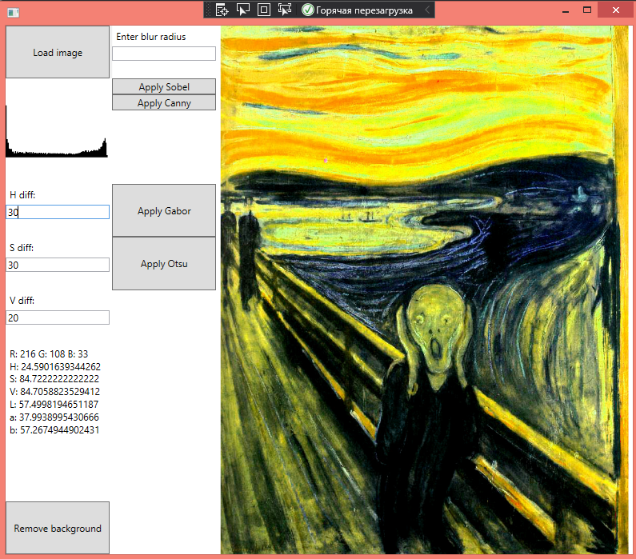

## Lab2
### Gaussian blur
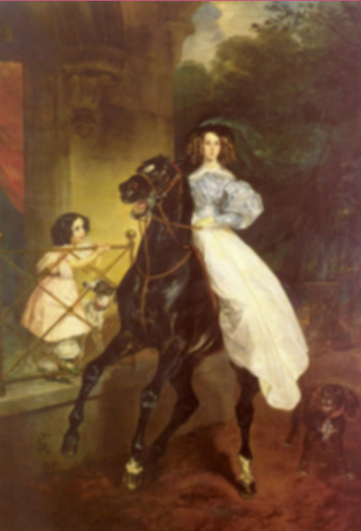
### Sobel
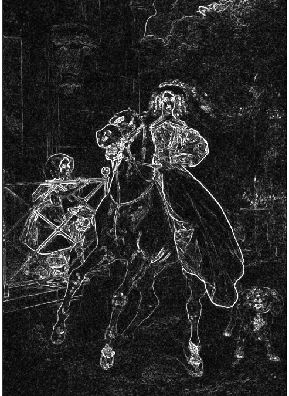
### Canny
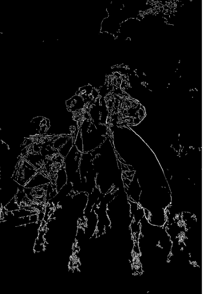
### Gabor
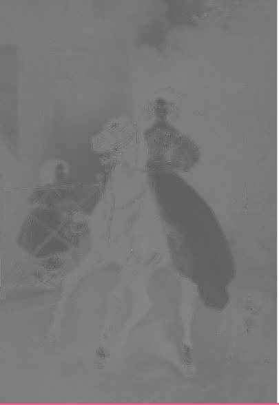
### Otsu
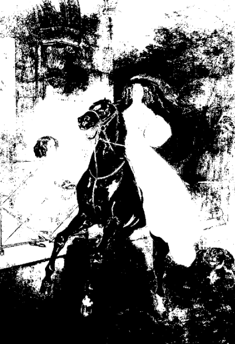

## Lab3
Cell counting by morphology
### Cells image
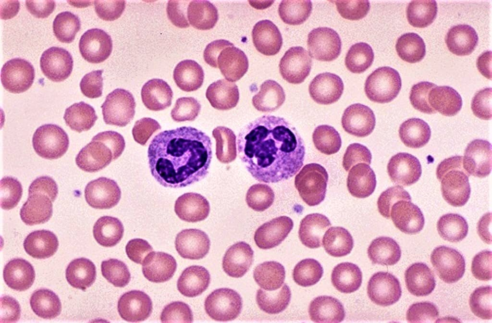
### Otsu
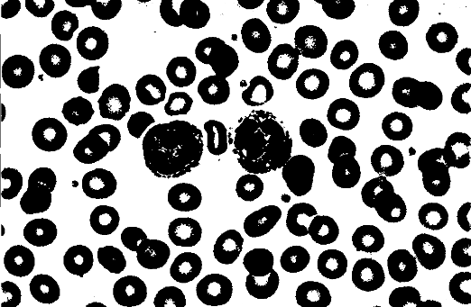
### Filling cells
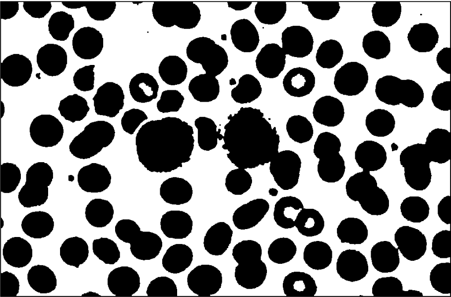
### Distance transform
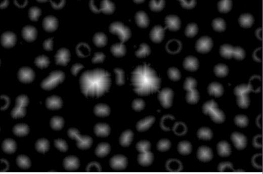
### Intensity transform
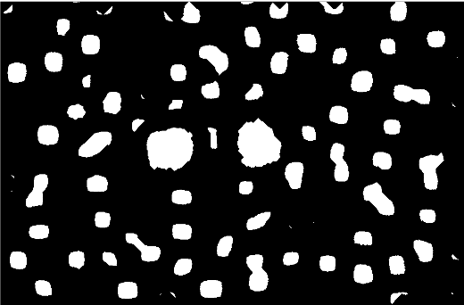
### After erosion and dilation
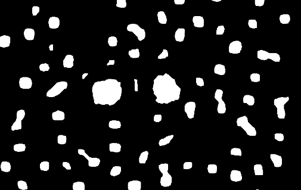
### Number of cells
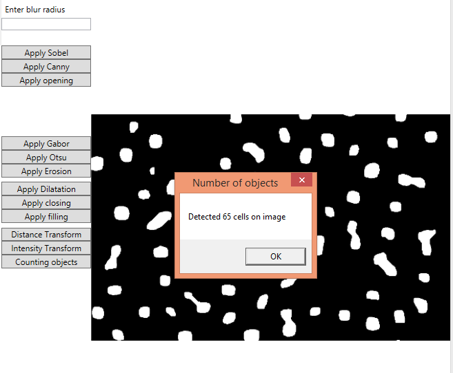 

## Lab4
Segmantation methods
### Split and merge
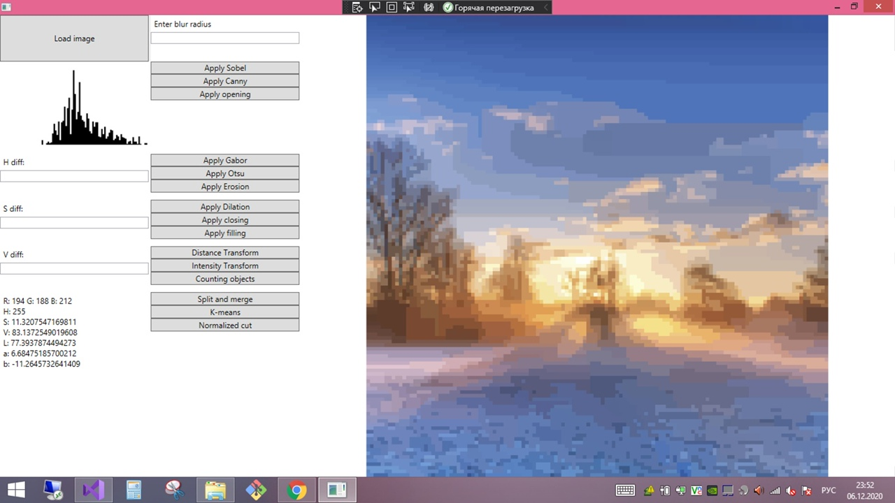
### K-means
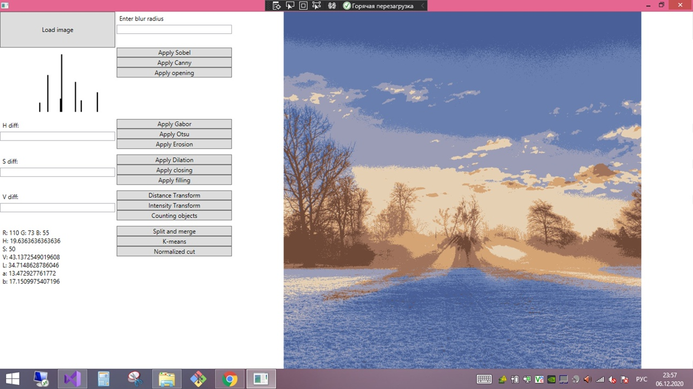
### Normalized cut
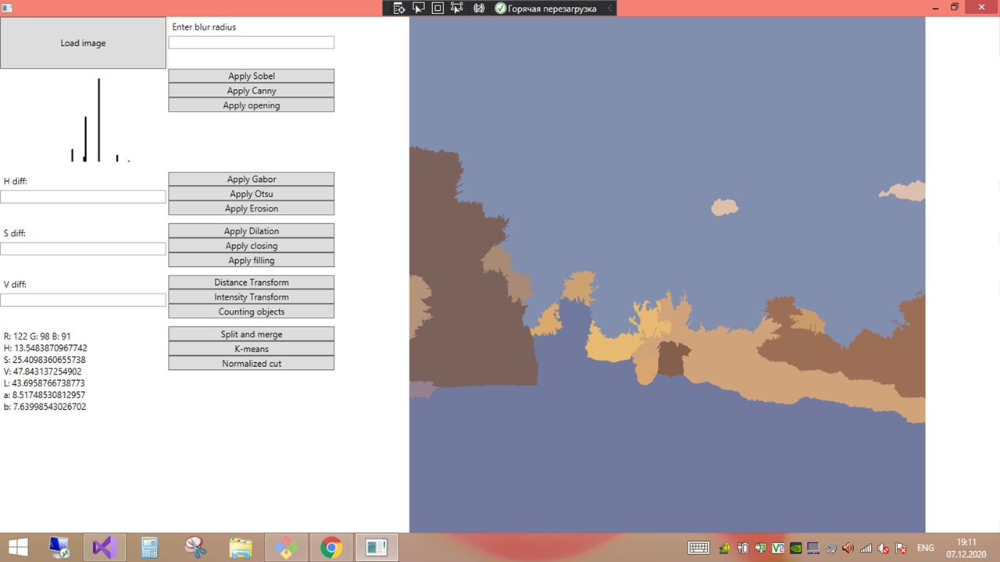
